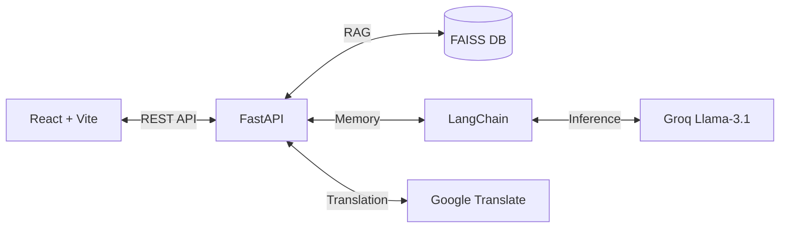

````carousel
# AarogyaBot (आरोग्यबॉट)
### Multilingual Healthcare Assistant for Rural India

**Vision**: Bridging the healthcare gap by providing instant, accurate, and localized medical assessments to communities with limited access to immediate medical care.

---
> [!NOTE]
> Swipe/Click right to proceed through the presentation.
<!-- slide -->
## 🚨 The Problem

1. **Doctor Shortage**: Rural India faces a severe shortage of specialized medical professionals.
2. **Language Barriers**: Most medical information and symptom checkers are available exclusively in English.
3. **Misinformation**: Rural populations often rely on inaccurate home remedies or self-medication for severe diseases like Malaria or TB.
4. **Delayed Treatment**: Patients often wait until symptoms become critical before traveling long distances to a Primary Health Centre (PHC).
<!-- slide -->
## 💡 The Solution: AarogyaBot

AarogyaBot acts as a **Top-Level Expert Doctor** accessible from any smartphone.

- **Multilingual**: Understands Hindi, Tamil, Telugu, Gujarati, Marathi, and Hinglish.
- **Voice-Enabled**: Users can speak their symptoms directly into their phones using native browser Speech-to-Text.
- **Expert Guidance**: Accurately diagnoses symptom clusters and suggests medically sound next steps and specific medicines.
- **Facility Locator**: Instantly locates the nearest Primary Health Centres using a 6-digit PIN code.
<!-- slide -->
## ⚙️ Technical Architecture

AarogyaBot is built on a modern, decoupled architecture:



**Key Technologies**:
- **Frontend**: React, TailwindCSS, Web Speech API
- **Backend**: FastAPI, Python
- **AI Core**: LangChain, Groq API (Llama-3.1), FAISS
<!-- slide -->
## 🧠 How the AI Works (RAG + Memory)

AarogyaBot doesn't just guess; it relies on a **Retrieval-Augmented Generation (RAG)** pipeline.

1. **Knowledge Base**: We maintain a strict database of rural diseases (Malaria, Dengue, TB) and their specific medicinal treatments.
2. **Vector Retrieval**: User symptoms are matched against this knowledge base using FAISS.
3. **Conversational Memory**: The bot tracks session history, allowing patients to ask follow-up questions naturally without repeating themselves.
4. **Safety Guardrails**: The AI is strictly instructed never to invent medical information and to trigger emergency protocols for red-flag symptoms.
<!-- slide -->
## 🚀 Future Roadmap

1. **Text-to-Speech (TTS)**: Allow the bot to read its medical advice out loud in the user's native language.
2. **WhatsApp Integration**: Deploy the bot directly to WhatsApp via the Twilio API for ultimate accessibility.
3. **Image Recognition**: Allow users to upload photos of skin rashes or wounds for visual diagnosis.
4. **Persistent Database**: Transition conversational memory from in-memory RAM to Redis/Supabase for long-term patient history tracking.
````
