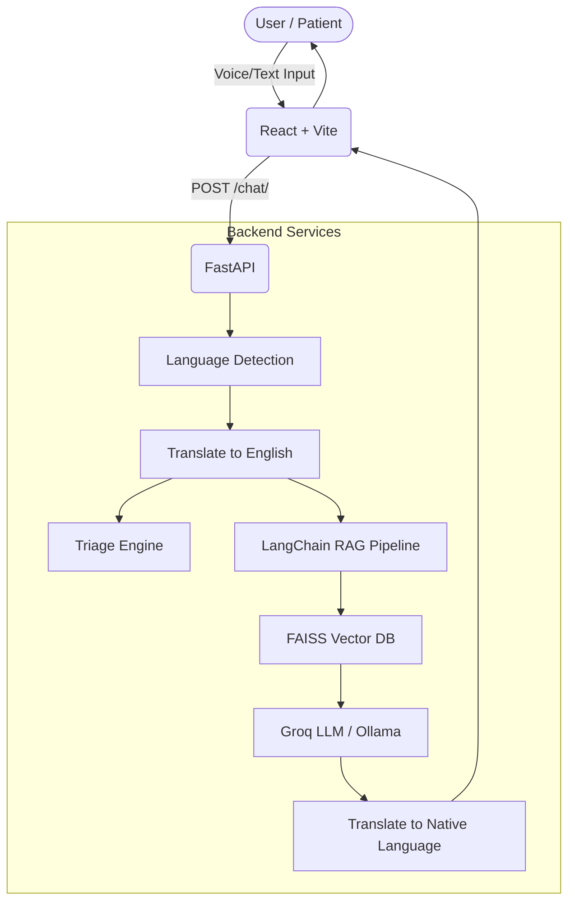

# AarogyaBot: Technical Documentation

## 1. Project Overview
**AarogyaBot** is a multilingual medical triage and healthcare facility assistant designed specifically for rural India. It addresses the critical gap in accessible, preliminary healthcare advice by providing users with instant, accurate medical assessments in their native languages. 

## 2. System Architecture
The application follows a modern decoupled Client-Server architecture:
- **Frontend (Client)**: A React-based Single Page Application (SPA) providing an interactive chat interface, voice input capabilities, and responsive UI cards for triage results and facility details.
- **Backend (Server)**: A FastAPI-based RESTful service that manages natural language processing, language translation, Retrieval-Augmented Generation (RAG) using LangChain, and database queries.

## 3. Technology Stack

### Frontend
* **Framework:** React (built with Vite for fast HMR)
* **Styling:** Tailwind CSS (Vanilla CSS for base rules)
* **Icons:** Lucide React
* **Speech Processing:** Native browser Web Speech API (`window.SpeechRecognition`) for Speech-to-Text.

### Backend
* **API Framework:** FastAPI
* **Server:** Uvicorn
* **AI & LLM Orchestration:** LangChain (`langchain_classic`)
* **Vector Database:** FAISS (Facebook AI Similarity Search)
* **Embeddings:** HuggingFace `sentence-transformers/all-MiniLM-L6-v2`
* **LLM Provider:** Groq (`llama-3.1-8b-instant`) with local Ollama fallback.
* **Translation:** `deep-translator` (Google Translate API)
* **Language Detection:** `langdetect` + Custom regex logic for Indic/Romanized scripts (Hinglish).

## 4. Core Workflows

### 4.1 Chat and Medical Triage
1. **Input Reception**: The frontend sends a text payload containing a `session_id` and `message`.
2. **Language Handling**: The backend detects the language (supporting Hindi, Tamil, Telugu, Gujarati, Marathi, etc.) and translates the query to English.
3. **Conversational Memory**: The `session_id` is mapped to an in-memory `ConversationBufferMemory` buffer, allowing the LLM to remember previous context.
4. **RAG Pipeline**: 
   - The query is vectorized.
   - FAISS retrieves relevant context from `health_docs` (containing `disease_profiles.txt`, `medicine_information.txt`, etc.).
   - A `ConversationalRetrievalChain` feeds the context and chat history to the Groq LLM.
5. **Response Translation**: The generated English medical assessment is translated back to the user's native language and returned to the frontend.

### 4.2 Facility Search (PIN Code)
1. If the user inputs a 6-digit number, the backend bypasses the LLM and directly queries the SQLite database (`phc_database.sqlite`).
2. It returns a list of Primary Health Centres (PHCs) or Community Health Centres (CHCs) in that PIN code area, along with their coordinates and phone numbers.

## 5. Security & Safety Mechanisms
> [!WARNING]
> Medical AI requires strict guardrails.

* **Top-Level Doctor Persona:** The prompt explicitly instructs the bot to be highly descriptive but strictly rely *only* on the provided context, refusing to invent medical information.
* **Fallback Mechanisms:** If the LLM fails (e.g., API key missing), a hardcoded safe response advises the patient to visit their nearest PHC immediately.
* **Triage Categorization:** A deterministic regex-based triage engine runs in parallel to the LLM, classifying urgency into `EMERGENCY` (red), `VISIT_PHC` (yellow), and `SELF_CARE` (green).

## 6. Deployment
* **Frontend**: Optimized for Vercel. Static assets are built via `npm run build`.
* **Backend**: Containerized using Nixpacks and deployed on Railway (as specified in `railway.json`). `uvicorn main:app --host 0.0.0.0 --port $PORT` runs the production server.
